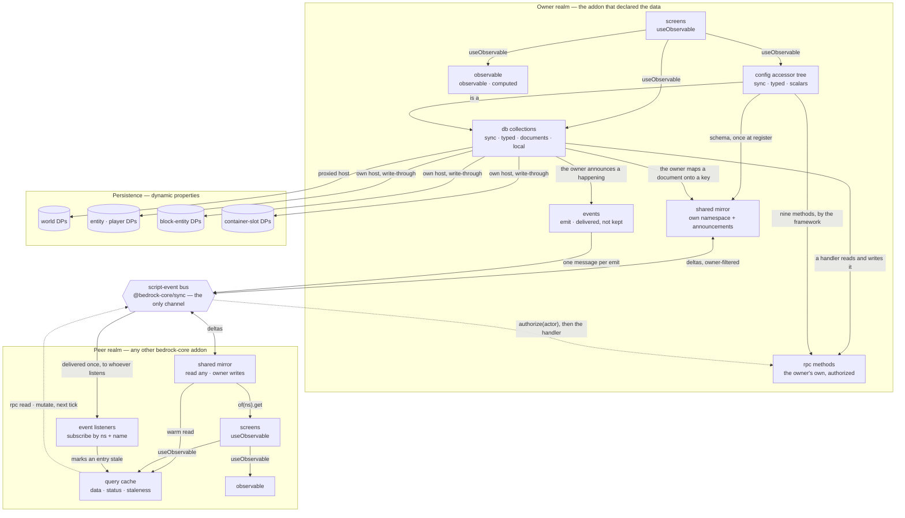
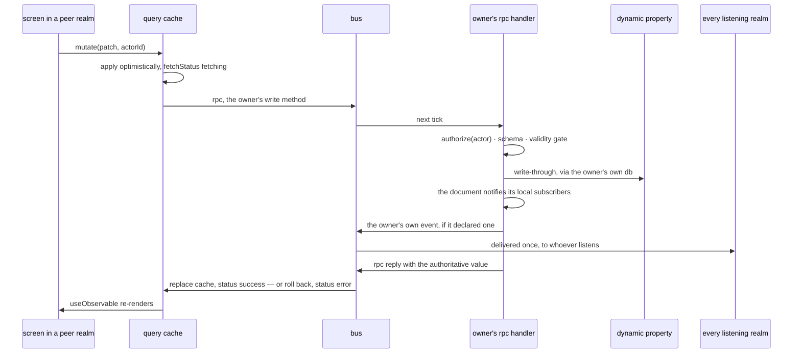

# 08 — Data flow

Every place a value can be seen, and every edge it can travel. One rule holds the picture
together: **exactly one concern owns each value, and every other place it appears is a view.**

## The map

## Where a value can be seen

| Place | Concern | Sync | Survives restart | Peers see it | Authoritative? |
| --- | --- | --- | --- | --- | --- |
| an **observable** | observable | yes | no | no | yes, for what it holds |
| the **config accessor tree** | db (config is a collection) | yes | via DPs | via query | yes |
| a **db document** | db | yes | via DPs | via query | **yes** |
| the **shared mirror**, own namespace | shared | yes | no | yes, locally | yes |
| the **shared mirror**, a peer's namespace | shared | yes | no | — | **no** — a copy; writes dropped |
| a **query** | query | yes (cached) | no | — | **no** — a cache with a status |
| **dynamic properties** | persistence | yes | **yes** | any pack that guesses the key | the bytes |
| `core.node.state` | transport | yes | no | yes | raw mirror, framework keys included |
| the **bus** | transport | next tick | no | yes | no |

Deliberately absent: scoreboards (commands and JSON UI reach; nothing here uses them), and any
copy of a peer's *documents* other than a query cache.

## The transfers

### 1. Value → dynamic property (persistence)

Config and db write through on change, 17 µs a write ([S2](./spikes/S2-dynamic-property-costs.md)).
Which DP depends on the resolved host ([03-db](./03-db.md#where-a-document-can-live--capability-not-declaration)).
The mirror persists nothing: a shared value that must survive a restart is a db document the owner
maps onto a key in one line.

### 2. Announcement → mirror (discovery, push)

Small, static, owner-written: config schema, i18n bundles, guides, feature flags, host election.
Broadcast once; every realm mirrors; a UI builds a form for a peer with no round trip.

### 3. Owner write → peer caches (invalidation or warm value)

Nothing here is automatic: db is local, so a peer learns a value moved only because the owner said
so. The owner mirrors the value on a `shared` key, or emits an event, or both. A query names
whichever of the two it wants and goes stale on it the same tick — or, from a mirrored key, simply
*has* the new value. That one declared edge is what replaces polling.

### 4. Peer → owner (RPC pull and mutate)

A query that is stale, or a `mutate`, is a request to the owner; the reply arrives next tick, is
authorized by actor, and is authoritative. The owner serves; nothing else does.

## One peer write, end to end

Every hop is tick-bounded and appears in the content log under the owner's namespace. A local
write is the same picture with the bus removed: authorize, persist, notify, publish.
